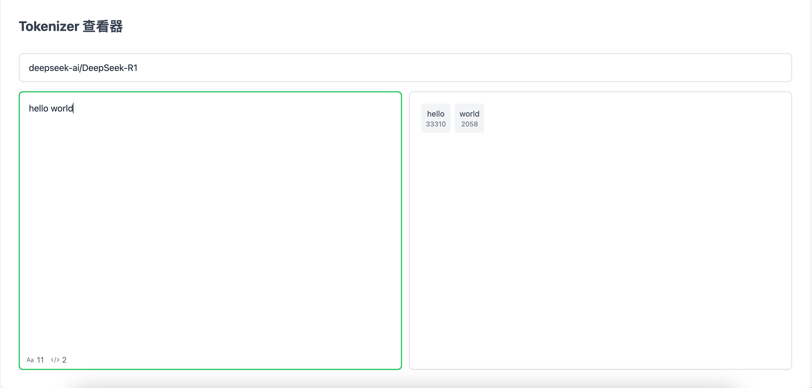

# Any Tokenizer Playground

一个用于探索来自huggingface模型不同分词器的演练场。



<h5 align='center'>
<b>基于 <a href="https://github.com/antfu/vitesse-lite">Vitesse-Lite</a></b>
</h5>

<br>

<p align='center'>
<a href="https://github.com/YOUR_USERNAME/any-tokenizer-playground/blob/main/README.md">English</a> | <b>简体中文</b>
</p>

<br>

## 特性

- ⚡️ 基于 Vue 3 + Vite 构建
- 🎨 使用 UnoCSS 的即时样式
- 🦾 TypeScript 支持
- ✅ Vitest 单元测试
- ☁️ Netlify 部署支持

## 开发

```bash
# 安装依赖
pnpm i

# 启动开发服务器
pnpm dev

# 构建生产版本
pnpm build

# 预览生产构建
pnpm preview
```
